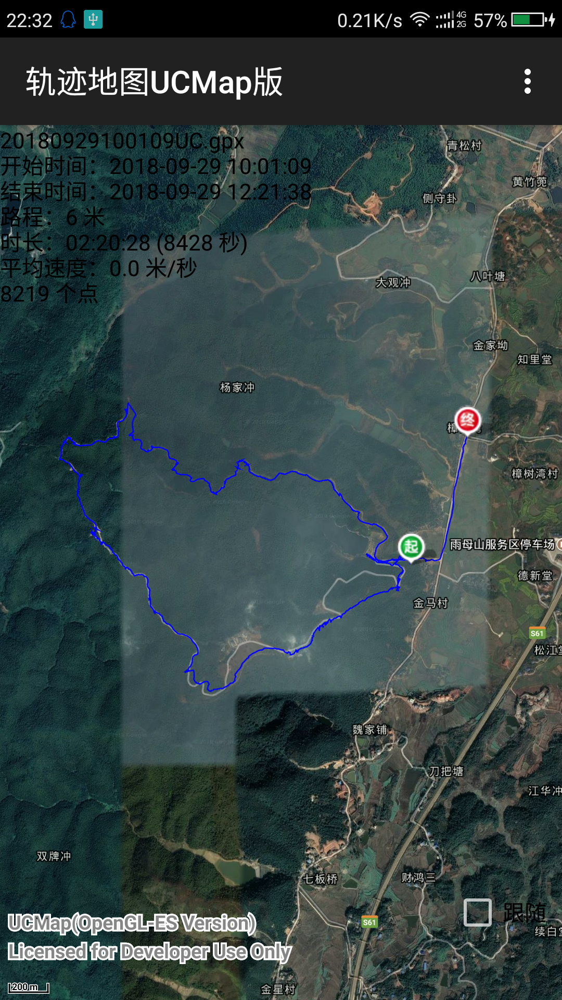

# Android: 轨迹地图UCMap版
基于安卓设备 GPS + UCMap 地图的超轻量级轨迹地图，可以显示当前轨迹，历史轨迹，发送定位数据到服务器。

### 已知问题：  
* 转换坐标后，测距工具坐标也会偏移。  
* 转换坐标后，Marker不动。

## 版本历史
1.3 (2020-08)  
* 解决 Android10 锁屏GPS休眠问题。  
* 解决 Android10 分享轨迹文件崩溃问题。  
* 增加 gpx 轨迹文件格式化。  
* 轨迹列表增加文件图标、大小、时间。
* 当前轨迹不同速度不同颜色。
* 历史轨迹动画和进度条。

## 参考
[解决 Android10 锁屏GPS休眠问题](https://blog.csdn.net/doris_d/article/details/102854998)  
[解决 Android10 分享文件崩溃问题](https://blog.csdn.net/xiaoyu940601/article/details/54406725)  
[坐标转换](https://blog.csdn.net/ma969070578/article/details/41013547)